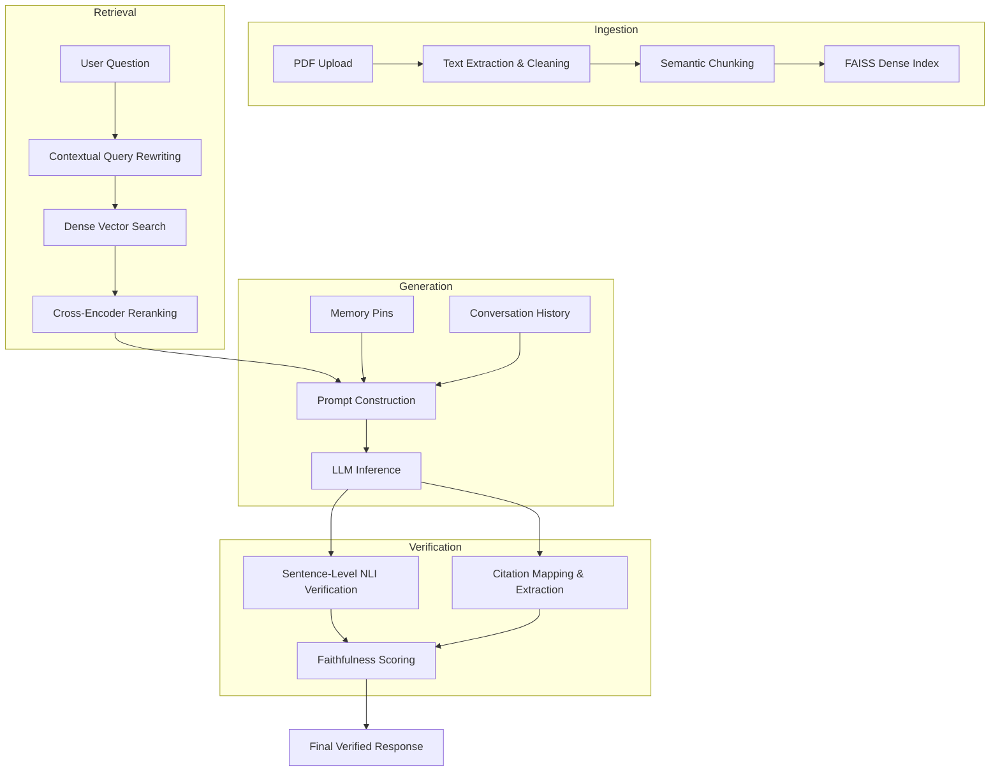

# Hallucination Controlled RAG on Scientific Documents


A premium AI research platform with hallucination control, multi-turn memory, and verifiable citation tracking.


---


## Advanced RAG Architecture


ResearchMind employs a sophisticated Retrieval-Augmented Generation (RAG) pipeline designed for academic and scientific discovery where precision is paramount.


### Hallucination-Controlled RAG Pipeline

- **Verifiable Citations**: Each factual claim is automatically mapped to specific document pages with [E1], [E2] markers.

- **Evidence-Only Grounding**: Responses are strictly constrained to retrieved context, preventing "world knowledge" hallucinations from the LLM.

- **Sentence-Level Verification**: Cross-Encoder and Natural Language Inference (NLI) models verify every sentence of the generated response before delivery.

- **Conversation Memory**: Multi-turn history awareness and "Memory Pins" maintain key facts across the entire research session.

- **Confidence Scoring**: Real-time metrics for faithfulness, support ratio, and citation coverage provide transparency into the model's reasoning.


### Tech Stack

- **Frontend**: React 19 + Vite (Modern Dark UI)

- **Backend**: FastAPI (Python 3.10+)

- **Pipeline**: FAISS (Dense Retrieval) + Cross-Encoder (Reranking) + Gemini/OpenAI (Inference)

- **Monitoring**: LangSmith + StructLog


---


## Core Features


| Feature | Description |

|---------|-------------|

| **Design System** | Professional three-column layout featuring Library, Chat, and Context Panels for an efficient research workflow. |

| **Memory Pins** | Pin specific insights from generated answers to keep them in permanent context for future questions within the session. |

| **Contextual Rewrites** | Automatically expands ambiguous queries using conversation history to ensure accurate retrieval. |

| **NLI Safety Gates** | Integrated Natural Language Inference for rigorous entailment checking of all claims. |

| **Global Library** | Track all indexed papers and session history in a unified research workspace. |


---


## Getting Started


### 1. Requirements

- Python 3.10+

- Node.js 20+

- Docker (optional)


### 2. Quick Setup (Local)

1. **Clone and Install Backend**:

 ```bash

 pip install -r requirements.txt

 ```

2. **Install Frontend**:

 ```bash

 cd webapp

 npm install

 ```

3. **Configure Environment**:

 Create a `.env` file with your `LLM_API_KEY`.


### 3. Running the Application

**Development Mode**

- Backend: `uvicorn api.app:app --reload --port 8000`

- Frontend: `cd webapp && npm run dev`


**Docker Compose**

```bash

docker-compose up --build

```


---


## Pipeline Architecture


The following diagram illustrates the end-to-end flow of data and verification within the ResearchMind system.





---


---

## Testing & Evaluation
Run integration tests for memory and context:
```bash
pytest tests/test_memory_integration.py -v
```

For full pipeline faithfulness evaluation:
```bash
python -m evaluation.run_evaluation
```

---

## Deployment & CI/CD
The project is configured for automated delivery via **GitHub Actions** and containerized deployment via **Docker**.

### 1. Docker Production Run
```bash
docker-compose up -d --build
```

### 2. CI/CD Pipeline
- **Linting**: Black formatting & Flake8 syntax checking.
- **Testing**: Automated `pytest` execution on every push.
- **Image Safety**: Multi-stage Docker build validation for zero-failure deployments.

---

## Support
Designed for academic research and high-precision scientific discovery.

